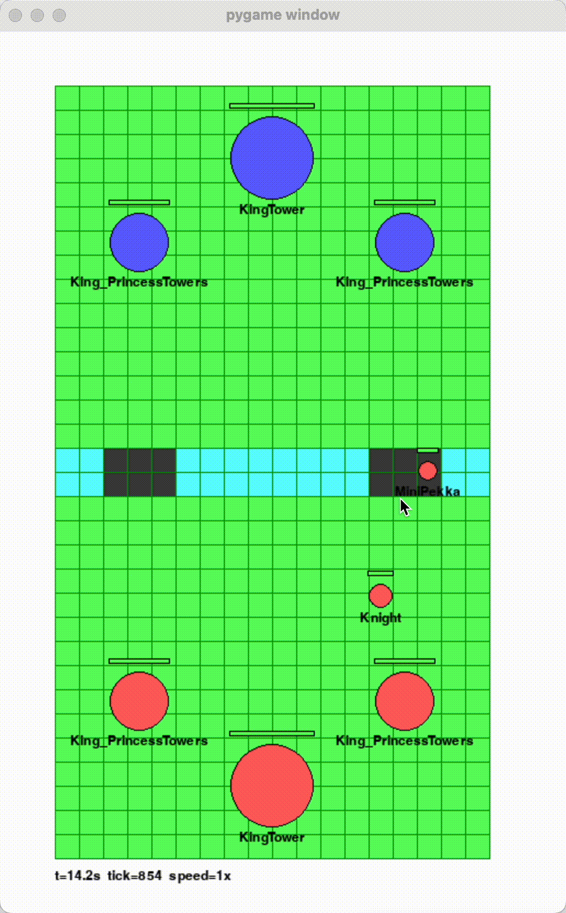

This project is still under active development. 

# Clash Royale Simulator 

## Why I created this repository
I like clash royale and want to train a RL agent to play the game. 
However, a simulator is needed to speed up training. I searched on GitHub and the only usable project I found
was samdickson22's [repository](https://github.com/samdickson22/clash-simulator). 

I did some investigation and found that although the simulator has most clash royale's features
implemented, the code is almost completely written by AI - hard to read and impossible for humans to make improvements on the code.

After examining the project structure more closely, I spent about 10 hours refactoring the core pieces of the codebase.
In the end, I realized that the only way to make all of this work is to re-implement the whole game from scratch, without any vibe-coding.

## Current Progress

- tower placement: done.
- troop spawning: done.
- pathfinding and going around obstacles: done.
- attacking and following enemy troops in sight: done.
- creating projectiles: done.

What's NOT done:
- spawn and death effects
- horde spawning
- spells
- evo, hero and elite card mechanics
- ...

## I need help

This project is far from finishing. I already poured more than 25 hours into this project and many more 
still lies ahead. If you want to contribute, please submit issues or pull requests. 

You are more than welcome to contact me via my email: `2243272839@qq.com`